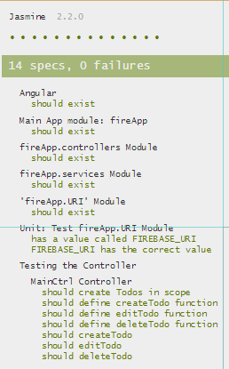

## Synopsis

The CRUD Todo App demonstrating how to use Firebase with Angular.

The program is originally based on a Node Todo Tutorial on [scotch.io](http://scotch.io/tutorials/javascript/creating-a-single-page-todo-app-with-node-and-angular). 

I use this Todo App to demonstrate hooking up different storage solutions to Angular via a REST API.
Other repositories contain Todo Apps demonstrating the following storage solutions:

- Node with MongoDB
- Node with PostgreSQL 
- Node with MySQL
- Node reading/writing to JSON file on server

## Technologies used
  
- [AngularJS](https://angularjs.org/)
- [Angular](https://angularjs.org/) 
- [Firebase](https://www.firebase.com/) 
- [AngularFire](https://www.firebase.com/docs/web/libraries/angular/index.html)
- [Bower](http://bower.io/)
- [Gulp](https://github.com/gulpjs/gulp)
- [Browserify](http://browserify.org/) - lets you use NPM module on the client
- [Karma](http://karma-runner.github.io/0.8/plus/AngularJS.html)
- [Jasmine](http://jasmine.github.io/2.2/introduction.html)
- [Selenium Webdriver](https://www.npmjs.com/package/selenium-manager)
- [Protractor](https://github.com/angular/protractor)

Note: I used Bower instead of Browserify to install Bootstrap as it contained a css file. Bootstrap is the only production library installed by Bower.  I have however installed all the libraries needed to run this app as development dependencies with Bower purely for development.  All the production libraries except Bootstrap are made available in a single minified file (bundled.min.js) thanks to Browserify and a few Gulp modules.  For development I have included _index-dev.html_ which does not use concatenated/minified files or Browserify.

## Requirements

* npm
* bower (npm install -g bower)
* Open a free Firebase account to get a URI (or use the demo URI included)
* Enter your Firebase URI in the _firebaseURI.js_ file in the services folder.
* I have entered a Demo URI used with one of the [Firebase demos](https://www.firebase.com/tutorial/#session/dpmkxhfbtvg) & it should work for you. However other users may be reading/writing to the location. 

## Installation

* Clone the Repository
* _npm install_
* _bower install_
* gulp - creates /build containing the production ready code (bundled, concatenated, minified)
* inside /build - Click on index-build.html

## Unit Testing

Two gulp tasks have been set up that run unit tests using Karma and Jasmine.  The default browser I have set up is the phantomJS headless browser.

- gulp unit:test - just runs the tests once
- gulp unit:tdd - runs the tests and automatically runs the tests when code changes occur. Note you can run this task and then browse to localhost:9876 and hit the debug button and you will see a GUI containing the test results.

    </img>

    </img>

## End-to-End Testing

A gulp task have been set up that will run end-to-end tests using [Protractor](https://github.com/angular/protractor),  [Selenium-Webdriver](https://code.google.com/p/selenium/wiki/WebDriverJs) and [Jasmine](http://jasmine.github.io/2.2/introduction.html).  Selenium-Webdriver needs to be started before the gulp e2e task can be run.  I set up a node server to make the App available on port 8000 purely to aid running Protractor tests.

Open a console window and run the node server:  
<pre>node server</pre>

Install selenium-manager globally:
<pre>npm install -g selenium-manager</pre>

Open a new console window and start the Selenium-manager:
<pre>selenium-manager start</pre>

Open a new console wondow and run the Protractor tests:
<pre>gulp e2e</pre>

## Screen Shot

    </img>

    Michael Cullen 
    2015

